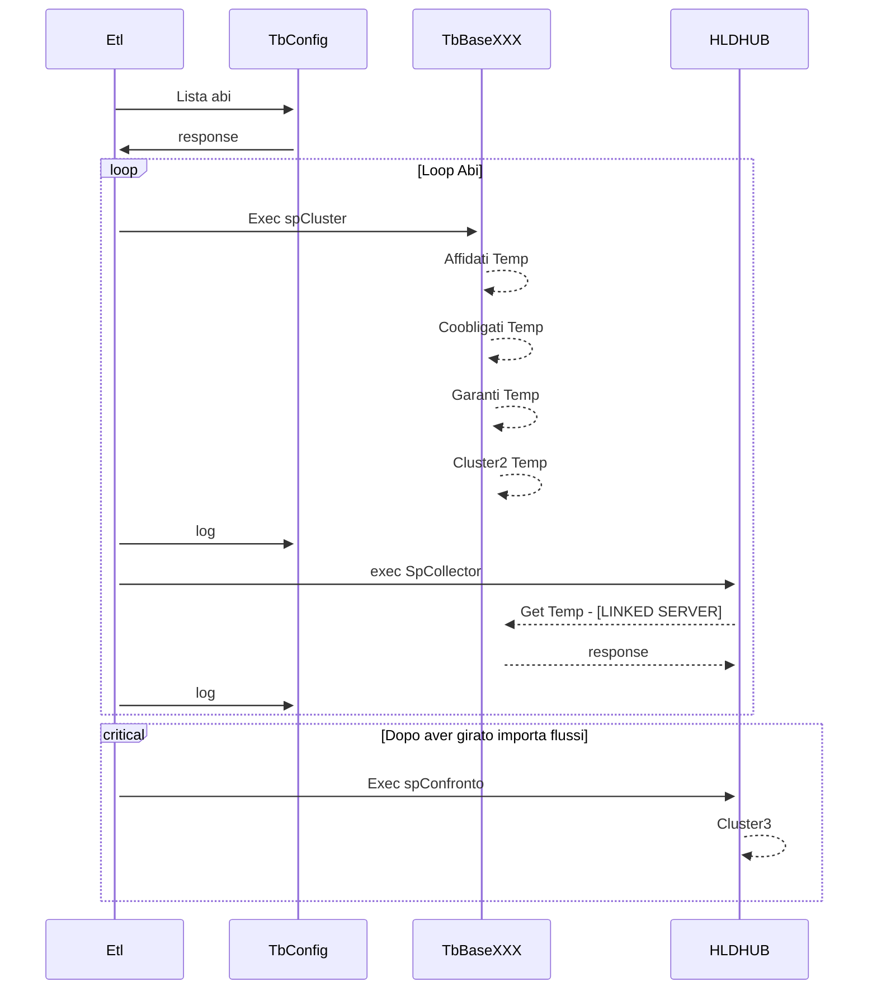

```mermaid
sequenceDiagram
    Etl->>+TbConfig: Lista abi
    TbConfig->>+Etl:response
    loop Loop Abi
    Etl->>+TbBaseXXX: Exec spCluster
    TbBaseXXX-->>+TbBaseXXX: Affidati Temp
    TbBaseXXX-->>+TbBaseXXX: Coobligati Temp
    TbBaseXXX-->>+TbBaseXXX: Garanti Temp
    TbBaseXXX-->>+TbBaseXXX: Cluster2 Temp
    Etl->>+TbConfig: log
    Etl->>+HLDHUB: exec SpCollector    
    HLDHUB-->>TbBaseXXX: Get Temp - [LINKED SERVER]
    TbBaseXXX-->>HLDHUB: response
    Etl->>+TbConfig: log
    end
    critical Dopo aver girato importa flussi
    Etl->>HLDHUB:Exec spConfronto
    HLDHUB-->>HLDHUB: Cluster3
    end
```

